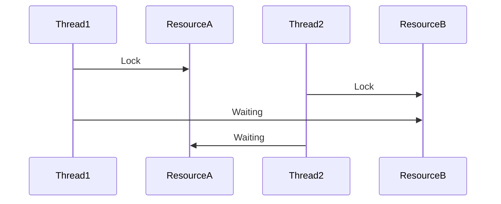
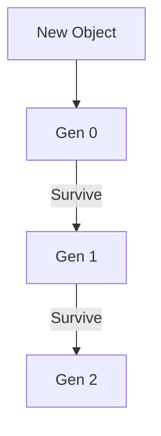

# 🚀 Fundamentals — Interview Master Guide (Enhanced)

> 🧠 Senior-level .NET interview preparation  
> ⚡ Deep concepts + real-world scenarios + advanced Q&A  

---

## 🎤 Advanced Interview Questions (Senior Level)

### ❓ Q1: How does CLR manage memory internally?

**Answer:**

CLR uses managed heap, stack, and GC.

- Stack → value types, method calls  
- Heap → reference types  
- GC → automatic memory cleanup  

#### 🔥 Insight
Gen 0 collections are frequent → fast  
Gen 2 collections → performance issue  

---

### ❓ Q2: What happens when you create an object in .NET?

1. Memory allocated in heap  
2. Reference stored in stack  
3. Constructor executed  
4. GC tracks object  

#### 🔥 Insight
Allocation is cheap, GC is expensive  

---

### ❓ Q3: Boxing/Unboxing impact?

- Boxing → heap allocation  
- Unboxing → casting  

#### ⚠️ Problem
Extra GC pressure  

#### ✅ Fix
Use generics instead of object collections  

---

### ❓ Q4: JIT optimization?

- Converts IL → native code  
- Applies runtime optimizations  

#### 🔥 Insight
Better than static compilation in many cases  

---

### ❓ Q5: Thread vs Task vs Async?

| Thread | Task | Async |
|--------|------|------|
| Low-level | High-level | Simplified |

#### 🔥 Tip
Use async/await instead of threads  

---

### ❓ Q6: Memory leaks in .NET?

Caused by:
- Static references  
- Events not unsubscribed  
- Long-lived objects  

---

### ❓ Q7: Large Object Heap?

- Objects > 85KB  
- Causes fragmentation  

---

### ❓ Q8: IEnumerable vs ICollection vs List?

| Type | Usage |
|------|------|
| IEnumerable | Read-only |
| ICollection | Add/remove |
| List | Full control |

---

### ❓ Q9: Assembly Load Context?

- Replaces AppDomain  
- Used for plugins and isolation  

---

### ❓ Q10: Exception handling internals?

- Stack unwinding  
- CLR finds catch block  

## 🎤 Additional Advanced Questions

---

### ❓ Q11: What is Garbage Collection pause (Stop-the-world)?

**Answer:**
- GC pauses application threads to reclaim memory  
- Called **Stop-the-world pause**

#### 🔥 Insight
- Frequent pauses → latency issues  
- Critical in **high-performance APIs**

---

### ❓ Q12: What is Finalization in .NET?

**Answer:**
- Used to clean unmanaged resources  
- Runs before GC collects object  

#### ⚠️ Problem
- Slows down GC  
- Should be avoided when possible  

---

### ❓ Q13: What is IDisposable pattern?

```csharp
public class Resource : IDisposable {
    public void Dispose() {
        // cleanup
    }
}
```

#### 🔥 Insight
- Used for DB connections, file handles  
- Always use `using`  

---

### ❓ Q14: What is difference between GC.Collect() and automatic GC?

**Answer:**
- GC.Collect() forces collection  
- Automatic GC decides optimal time  

#### ⚠️ Tip
👉 Avoid manual GC calls  

---

### ❓ Q15: What is ThreadPool?

**Answer:**
- Pool of worker threads managed by CLR  
- Reuses threads → better performance  

---

### ❓ Q16: What is deadlock?



#### 🔥 Insight
- Happens due to circular dependency  
- Avoid nested locks  

---

### ❓ Q17: What is async deadlock?

**Answer:**
- Happens due to `.Result` or `.Wait()`  

#### ❌ Example
```csharp
var result = GetDataAsync().Result;
```

#### ✅ Fix
```csharp
await GetDataAsync();
```

---

### ❓ Q18: What is immutability?

**Answer:**
- Object cannot change after creation  

#### 🔥 Benefit
- Thread-safe  
- Predictable behavior  

---

### ❓ Q19: What is reflection?

**Answer:**
- Inspect metadata at runtime  

#### ⚠️ Problem
- Slow → avoid in hot paths  

---

### ❓ Q20: What is Span<T>?

**Answer:**
- Stack-only type  
- Avoids allocations  

#### 🔥 Use Case
- High-performance parsing  

---

## 📊 GC Lifecycle



---

## 🎯 Final Revision Points

- GC pauses impact latency  
- Avoid manual GC  
- Use async properly  
- Avoid deadlocks  
- Prefer immutability  

---

## 🎤 Final Advice

> Senior interviews test your **thinking, not memory**