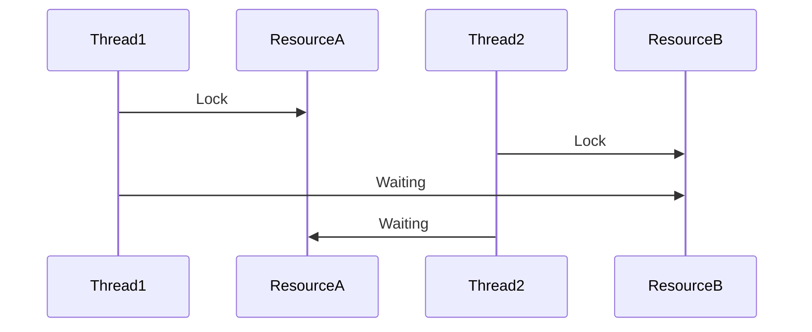
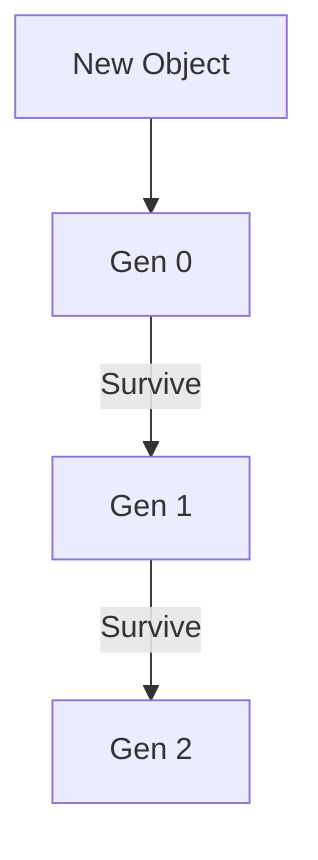

# 🚀 Fundamentals — Interview Master Guide (Enhanced)

> 🧠 Senior-level .NET interview preparation  
> ⚡ Deep concepts + real-world scenarios + advanced Q&A  

---

## 🎤 Advanced Interview Questions (Senior Level)

### ❓ Q1: How does CLR manage memory internally?

**Answer:**

CLR uses managed heap, stack, and GC.

- Stack → value types, method calls  
- Heap → reference types  
- GC → automatic memory cleanup  

#### 🔥 Insight
Gen 0 collections are frequent → fast  
Gen 2 collections → performance issue  

---

### ❓ Q2: What happens when you create an object in .NET?

1. Memory allocated in heap  
2. Reference stored in stack  
3. Constructor executed  
4. GC tracks object  

#### 🔥 Insight
Allocation is cheap, GC is expensive  

---

### ❓ Q3: Boxing/Unboxing impact?

- Boxing → heap allocation  
- Unboxing → casting  

#### ⚠️ Problem
Extra GC pressure  

#### ✅ Fix
Use generics instead of object collections  

---

### ❓ Q4: JIT optimization?

- Converts IL → native code  
- Applies runtime optimizations  

#### 🔥 Insight
Better than static compilation in many cases  

---

### ❓ Q5: Thread vs Task vs Async?

| Thread | Task | Async |
|--------|------|------|
| Low-level | High-level | Simplified |

#### 🔥 Tip
Use async/await instead of threads  

async/await in .NET Core
The Problem Thread Starvation
In a web app, each request gets a thread from the thread pool. If you call a database or HTTP API synchronously, that thread blocks waiting for I/O to complete:

// Thread pool hands this request Thread A
public IActionResult GetUser(int id)
{
    // Thread A sits here doing NOTHING for 50ms
    // while the DB query runs. It can't serve other requests.
    var user = _dbContext.Users.Find(id);
    
    // Thread A wakes up, sends the response, goes back to pool
    return Ok(user);
}
With 100 concurrent requests, you need 100 threads. Each thread costs ~1MB of stack memory. Under high load, the thread pool runs out → requests queue → timeouts → 503s.

The Solution Non-blocking I/O
public async Task<IActionResult> GetUser(int id)
{
    // Thread A starts the DB query, then IMMEDIATELY
    // returns to the thread pool to serve other requests
    var user = await _dbContext.Users.FindAsync(id);
    
    // When the DB result comes back (50ms later),
    // Thread B (or any available thread) resumes here
    return Ok(user);
}
With 100 concurrent async requests, you can still serve them with just 2-3 threads because threads aren't blocked waiting.

How async and await Actually Work
async on a method signature does two things:

Enables await inside the method
Tells the compiler to transform the method into a state machine
await does the magic:

Checks if the task is already complete (optimization)
If not, suspends the method, captures the current context, and returns an incomplete Task to the caller
When the awaited operation completes, the state machine resumes the method from where it paused
The compiler transforms this:

public async Task<User> GetUserAsync(int id)
{
    var user = await _dbContext.Users.FindAsync(id);
    var orders = await _orderRepo.GetOrdersAsync(user.Id);
    return new UserWithOrders(user, orders);
}
Into something conceptually like this:

public Task<User> GetUserAsync(int id)
{
    var stateMachine = new GetUserAsyncStateMachine();
    stateMachine.id = id;
    stateMachine.builder = AsyncTaskMethodBuilder<User>.Create();
    stateMachine.state = -1;
    stateMachine.builder.Start(ref stateMachine);
    return stateMachine.builder.Task;
}

struct GetUserAsyncStateMachine : IAsyncStateMachine
{
    public int state;
    public int id;
    public User user;
    public List<Order> orders;
    public AsyncTaskMethodBuilder<User> builder;
    private TaskAwaiter<User> awaiter1;
    private TaskAwaiter<List<Order>> awaiter2;

    public void MoveNext()
    {
        try
        {
            switch (state)
            {
                case -1: // First call
                    awaiter1 = _dbContext.Users.FindAsync(id).GetAwaiter();
                    if (!awaiter1.IsCompleted)
                    {
                        state = 0;
                        builder.AwaitUnsafeOnCompleted(ref awaiter1, ref this);
                        return; // <<< SUSPENDS HERE — thread returns to pool
                    }
                    goto case 0;
                    
                case 0: // Resumed after FindAsync
                    user = awaiter1.GetResult();
                    awaiter2 = _orderRepo.GetOrdersAsync(user.Id).GetAwaiter();
                    if (!awaiter2.IsCompleted)
                    {
                        state = 1;
                        builder.AwaitUnsafeOnCompleted(ref awaiter2, ref this);
                        return; // <<< SUSPENDS AGAIN
                    }
                    goto case 1;
                    
                case 1: // Resumed after GetOrdersAsync
                    orders = awaiter2.GetResult();
                    builder.SetResult(new UserWithOrders(user, orders));
                    break;
            }
        }
        catch (Exception ex)
        {
            builder.SetException(ex);
        }
    }
}
The key: the method is rewritten as a struct with a MoveNext() that runs on every resume. Each await is a return; point that frees the thread.

Task, Task<T>, and ValueTask
Type	Use	Memory
Task	Void-returning async	Allocates on heap (4KB)
Task<T>	Returns a value async	Allocates on heap
ValueTask<T>	When result is often synchronous	Struct (no allocation if completes sync)
ValueTask	Void-returning, often sync	Rarely used
// Task: always allocates
public async Task<User> FindAsync(int id) { ... }

// ValueTask: avoids allocation when result is cached/immediate
private Dictionary<int, User> _cache;
public ValueTask<User> FindCachedAsync(int id)
{
    if (_cache.TryGetValue(id, out var user))
        return new ValueTask<User>(user); // no allocation, synchronous
    return new ValueTask<User>(LoadFromDbAsync(id)); // falls through to async
}
What NOT To Do
1. Blocking on async code (deadlock risk):

// ❌ DEADLOCKS in ASP.NET (SynchronizationContext)
var user = _dbContext.Users.FindAsync(id).Result;
var user = _dbContext.Users.FindAsync(id).Wait();

// ✅ Correct
var user = await _dbContext.Users.FindAsync(id);
2. Async void (crash risk):

// ❌ Exception crashes the process — caller can't catch it
public async void Button_Click() { throw new Exception(); }

// ✅ Use async Task
public async Task DoWorkAsync() { throw new Exception(); } // caller can catch
3. Mixing sync and async (thread pool starvation):

// ❌ Blocks an async thread — wastes thread pool
public async Task<IActionResult> Get()
{
    var data = SomeSyncMethod(); // blocking call inside async
    return Ok(await _service.ProcessAsync(data));
}

// ✅ Keep all I/O async end-to-end
public async Task<IActionResult> Get()
{
    var data = SomeSyncMethod(); // fine if it's CPU-bound and fast
    return Ok(await _service.ProcessAsync(data));
}
4. Multiple awaits without concurrency (sequential slowdown):

// ❌ Sequential — takes 300ms total
var a = await CallServiceA(); // 100ms
var b = await CallServiceB(); // 100ms
var c = await CallServiceC(); // 100ms

// ✅ Concurrent — takes 100ms total
var taskA = CallServiceA();   // starts immediately
var taskB = CallServiceB();   // starts immediately
var taskC = CallServiceC();   // starts immediately
var results = await Task.WhenAll(taskA, taskB, taskC); // wait for all
Real Patterns in .NET Core APIs
In controllers:

[HttpGet("{id}")]
public async Task<ActionResult<User>> GetUser(int id)
{
    var user = await _userService.GetByIdAsync(id);
    if (user is null) return NotFound();
    return Ok(user);
}
In EF Core (always async for production):

public async Task<List<User>> GetActiveUsers(int page, int pageSize)
{
    return await _context.Users
        .Where(u => u.IsActive)
        .OrderBy(u => u.CreatedAt)
        .Skip(page * pageSize)
        .Take(pageSize)
        .ToListAsync(); // SELECT ... WHERE Active = 1 ORDER BY ... OFFSET ... FETCH ...
}
In HttpClient:

public async Task<Product> FetchProductAsync(int id)
{
    var response = await _httpClient.GetAsync($"/api/products/{id}");
    response.EnsureSuccessStatusCode();
    return await response.Content.ReadFromJsonAsync<Product>();
}
In middleware:

public async Task InvokeAsync(HttpContext context, RequestDelegate next)
{
    var stopwatch = Stopwatch.StartNew();
    await next(context); // pass to next middleware
    stopwatch.Stop();
    _logger.LogInformation("Request took {ms}ms", stopwatch.ElapsedMilliseconds);
}
Summary
Concept	What happens
async	Tells compiler to build state machine
await	If task incomplete → suspend method, free thread, resume later
State machine	Compiler-generated struct that tracks where you paused
Continuation	Code after await runs on any thread pool thread
Thread pool	Serves 1000+ concurrent requests with ~10 threads via async
Task	Promises/completions — not threads
ConfigureAwait(false)	Skips SynchronizationContext resume — slightly faster in ASP.NET Core (ASP.NET Core has no SynchronizationContext, so it's a no-op in modern .NET)

---

### ❓ Q6: Memory leaks in .NET?

Caused by:
- Static references  
- Events not unsubscribed  
- Long-lived objects  

---

### ❓ Q7: Large Object Heap?

- Objects > 85KB  
- Causes fragmentation  

---

### ❓ Q8: IEnumerable vs ICollection vs List?

| Type | Usage |
|------|------|
| IEnumerable | Read-only |
| ICollection | Add/remove |
| List | Full control |

---

### ❓ Q9: Assembly Load Context?

- Replaces AppDomain  
- Used for plugins and isolation  

---

### ❓ Q10: Exception handling internals?

- Stack unwinding  
- CLR finds catch block  

## 🎤 Additional Advanced Questions

---

### ❓ Q11: What is Garbage Collection pause (Stop-the-world)?

**Answer:**
- GC pauses application threads to reclaim memory  
- Called **Stop-the-world pause**

#### 🔥 Insight
- Frequent pauses → latency issues  
- Critical in **high-performance APIs**

---

### ❓ Q12: What is Finalization in .NET?

**Answer:**
- Used to clean unmanaged resources  
- Runs before GC collects object  

#### ⚠️ Problem
- Slows down GC  
- Should be avoided when possible  

---

### ❓ Q13: What is IDisposable pattern?

```csharp
public class Resource : IDisposable {
    public void Dispose() {
        // cleanup
    }
}
```

#### 🔥 Insight
- Used for DB connections, file handles  
- Always use `using`  

---

### ❓ Q14: What is difference between GC.Collect() and automatic GC?

**Answer:**
- GC.Collect() forces collection  
- Automatic GC decides optimal time  

#### ⚠️ Tip
👉 Avoid manual GC calls  

---

### ❓ Q15: What is ThreadPool?

**Answer:**
- Pool of worker threads managed by CLR  
- Reuses threads → better performance  

---

### ❓ Q16: What is deadlock?



#### 🔥 Insight
- Happens due to circular dependency  
- Avoid nested locks  

---

### ❓ Q17: What is async deadlock?

**Answer:**
- Happens due to `.Result` or `.Wait()`  

#### ❌ Example
```csharp
var result = GetDataAsync().Result;
```

#### ✅ Fix
```csharp
await GetDataAsync();
```

---

### ❓ Q18: What is immutability?

**Answer:**
- Object cannot change after creation  

#### 🔥 Benefit
- Thread-safe  
- Predictable behavior  

---

### ❓ Q19: What is reflection?

**Answer:**
- Inspect metadata at runtime  

#### ⚠️ Problem
- Slow → avoid in hot paths  

---

### ❓ Q20: What is Span<T>?

**Answer:**
- Stack-only type  
- Avoids allocations  

#### 🔥 Use Case
- High-performance parsing  

---

## 📊 GC Lifecycle



---

## 🎯 Final Revision Points

- GC pauses impact latency  
- Avoid manual GC  
- Use async properly  
- Avoid deadlocks  
- Prefer immutability  

---

## 🎤 Final Advice

> Senior interviews test your **thinking, not memory**
