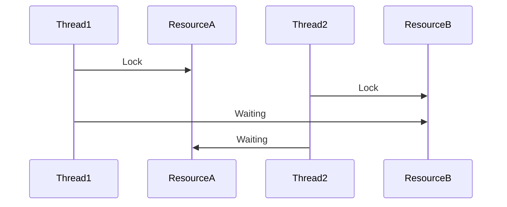
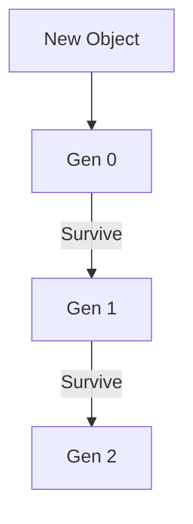

# 🚀 Fundamentals — Interview Master Guide (Enhanced)

> 🧠 Senior-level .NET interview preparation  
> ⚡ Deep concepts + real-world scenarios + advanced Q&A  

---

## 🎤 Advanced Interview Questions (Senior Level)

### ❓ Q1: How does CLR manage memory internally?

**Answer:**

How CLR Manages Memory Internally
The Execution Layer
When you write C#:

public class OrderService
{
    private readonly decimal _taxRate = 0.18m;

    public decimal CalculateTotal(Order order)
    {
        var subtotal = order.Items.Sum(i => i.Price * i.Quantity);
        var tax = subtotal * _taxRate;
        return subtotal + tax;
    }
}
C# compiler → IL (Intermediate Language) → CLR's JIT (Just-In-Time) compiler → native machine code.

The CLR has three memory regions:

1. The Stack (Thread-Local, LIFO)
Each thread gets its own stack (~1MB default). Used for:

Value types (locals and method parameters)
Method call frames (return address, saved registers, exception handling info)
public int Add(int a, int b)
{
    int result = a + b;  // a, b, result all on stack
    return result;
}
Stack layout when Add(3, 5) is called:
┌─────────────────────┐
│   return address     │ ← pushed by CALL instruction
│   a = 3              │ ← pushed as argument
│   b = 5              │ ← pushed as argument
│   result = 8         │ ← locals
├─────────────────────┤
│   ... previous frame │
Stack is self-cleaning: when Add returns, the stack pointer moves back up. No cleanup needed. That's why value types are cheap — allocate and free in a single pointer move.

Before call:     SP → ┌───────┐
                      │frame N│
After call:      SP → ┌───────┐
                      │frame N│
                      │a = 3  │
                      │b = 5  │
                      │result │
After return:    SP → ┌───────┐
                      │frame N│ ← result is gone. No GC needed.
Stack vs Heap allocation for value types:

public void Demo()
{
    int x = 42;            // STACK — just a pointer bump
    
    object o = x;          // HEAP — boxing allocates on heap
                           // The value 42 is copied into a heap object
}
2. The Heap (Managed Heap, Shared Across Threads)
All reference types live here: class instances, arrays, strings, delegates, boxed value types.

public class Order
{
    public int Id { get; set; }          // Id itself is on heap (it's a field of a class)
    public List<Item> Items { get; set; } // Items reference on heap
}

public void CreateOrder()
{
    Order order = new Order(); // 'order' ref on stack, the Order object on heap
}
Stack                          Heap
┌──────────┐                 ┌──────────────────────┐
│ order ────────→            │ Order object          │
│           │                │ [SyncBlock]           │
│           │                │ [TypeHandle] → Order  │
│           │                │ Id: 0                 │
│           │                │ Items: null           │
│           │                └──────────────────────┘
Three sections within the managed heap:

Generation	Size threshold	Collection frequency	Contains
Gen 0	~256KB - 4MB (adjusts)	Very frequent (every ~1s under load)	Short-lived objects (locals, iterators)
Gen 1	~2MB - 10MB	Moderate	Objects that survived 1 collection
Gen 2	Dynamic	Rare (expensive)	Long-lived objects (static data, cache, singletons)
Large Object Heap (LOH)	Objects ≥ 85,000 bytes	Rare	Arrays, strings, large buffers, byte[]
Why Generations Exist
Most objects die young. 90% of objects are never alive for a second Gen 0 collection.

public string ProcessOrder(int orderId)
{
    var order = _db.Orders.Find(orderId);  // ← Gen 0
    var summary = $"Order #{order.Id}";     // ← Gen 0 (string)
    var items = order.Items.ToList();       // ← Gen 0
    
    // Most of these Gen 0 objects die when the method returns
    
    SendEmail(summary, items);
    
    return summary;                         // ← summary survives → Gen 1
}
Gen 0 collects tiny objects rapidly without touching Gen 1 or Gen 2. That's the performance secret.

3. The Garbage Collector (GC)
When Does GC Trigger?
Gen 0 fills up (most common — happens constantly in a busy app)
GC.Collect() called explicitly (don't do this)
System is low on memory (OutOfMemory threshold)
AppDomain unloads
What GC Actually Does (3 Phases)
Phase 1: Mark

The GC starts from roots: static fields, thread stack locals, CPU registers, GC handles (pinned objects).

public class OrderProcessor
{
    private static List<Order> _activeOrders = new(); // ROOT (static field)
    
    public void Process(Order order)
    {
        var calculator = new TaxCalculator();          // ROOT (stack local)
        var result = calculator.Calculate(order);      
        _activeOrders.Add(order);                      // order is reachable
    } // calculator dies here (not a root anymore)
}
GC walks the object graph from all roots:

_activeOrders → List<Order> → each Order → each Order.Items → each Item
Mark every reachable object with a bit flag
Any object NOT marked = garbage
Before Mark (heap state):
┌─────────────────────────────┐
│ [Order A] ← reachable        │ → Mark: ✓
│ [Item 1]  ← reachable        │ → Mark: ✓
│ [Item 2]  ← reachable        │ → Mark: ✓
│ [TaxCalc] ← NOT reachable    │ → Mark: ✗ (GARBAGE)
│ [String]  ← reachable        │ → Mark: ✓
│ [CachedOrder] ← NOT reachable│ → Mark: ✗ (GARBAGE)
└─────────────────────────────┘
Phase 2: Sweep / Compact

Two strategies:

Sweep-only (Gen 2, LOH): Build a "free list" of dead object gaps. New allocations reuse the gaps. Fast but causes fragmentation.
After Sweep (fragmented):
┌────────────┬──────────┬──────────┐
│ Order A    │ FREE     │ Item 1   │
│ Item 2     │ FREE     │ String   │
└────────────┴──────────┴──────────┘
Sweep + Compact (Gen 0, Gen 1): After marking, slide all live objects together to eliminate gaps. Updates all references to point to the new addresses.
After Compact:
┌─────────────────────────────┐
│ Order A │ Item 1 │ Item 2   │
│ String  │                  │
└─────────────────────────────┘
      ↑ Compacted end — next allocation starts here
This is why the managed heap is fast: new object() is just ptr += sizeOfObject. No free-list search like malloc.

Phase 3: Bump the generation

Surviving objects in Gen 0 get promoted to Gen 1. Surviving Gen 1 objects get promoted to Gen 2.

// After a Gen 0 collection:
// Gen 0 survivors → moved to Gen 1
// Gen 1 survivors → promoted to Gen 2 (if they exist)
// Gen 0 is now empty — fast allocations resume
GC Modes
Mode	Description	Best for
Workstation GC	Per-process, one thread for GC	Desktop apps, single-core
Server GC	Per-core, each core has its own heap + GC thread	ASP.NET Core, high-throughput
Background GC	Concurrent (non-blocking) collections	Apps that can't pause (real-time UI, low-latency APIs)
ASP.NET Core defaults to Server + Background GC. Your app keeps serving requests while GC runs in the background.

<!-- .csproj to switch mode -->
<PropertyGroup>
  <ServerGarbageCollection>true</ServerGarbageCollection>
  <ConcurrentGarbageCollection>true</ConcurrentGarbageCollection>
</PropertyGroup>
Object Header (Every Heap Object)
Every object on the heap has 8-16 bytes of overhead:

┌──────────────────────────────┐
│ SyncBlock Index (4 bytes)    │ ← Thread synchronization, hash code cache
│ TypeHandle Pointer (4/8 bytes)│ ← Points to method table (vtable)
│ Instance fields ...          │
└──────────────────────────────┘
public class Point { public int X; public int Y; }

// var p = new Point { X = 1, Y = 2 };
// Heap layout:
// [SyncBlock: 0] [TypeHandle → Point] [X: 1] [Y: 2]
// Total: 4 + 8 + 4 + 4 = 20 bytes (aligned to 24)
SyncBlock is lazily allocated — most objects have 0, meaning no sync block data allocated. Only when you lock(obj) or call GetHashCode() does the CLR allocate the actual sync block entry.

Real-World Memory Leaks (Not GC Failures)
1. Static references (objects never die)
public static class Cache
{
    private static List<byte[]> _data = new();
    
    public static void Add(byte[] data) => _data.Add(data);
    // _data is a root → objects never collected → permanent leak
}
2. Event handlers (subscriber keeps publisher alive)
public class Publisher
{
    public event EventHandler SomethingHappened;
}

public class Subscriber
{
    public void Subscribe(Publisher p)
    {
        p.SomethingHappened += OnSomethingHappened;
        // 'this' (Subscriber) is now referenced by Publisher
        // Publisher won't let Subscriber be collected
    }
}
3. Captured variables in lambdas
public class Service
{
    private byte[] _largeBuffer = new byte[1_000_000];
    
    public Action CreateAction()
    {
        return () => Console.WriteLine(_largeBuffer[0]);
        // The closure captures 'this', keeping _largeBuffer alive
    }
}
4. Improper finalizers
public class ResourceHolder
{
    ~ResourceHolder() // FINALIZER
    {
        // cleanup
    }
}
A class with a finalizer:

On allocation, GC puts it on the Finalization Queue
On collection, instead of freeing memory, GC moves it to the Freachable Queue
A dedicated finalizer thread runs the ~Finalizer() method
Only THEN is the memory freed
This means the object survives an extra collection. Always implement IDisposable instead:

public class ResourceHolder : IDisposable
{
    private IntPtr _nativeResource;
    
    public void Dispose()
    {
        ReleaseNativeResource();
        GC.SuppressFinalize(this); // tells GC "skip the finalizer"
    }
}
Large Object Heap (LOH)
Objects ≥ 85,000 bytes go to the LOH:

byte[] buffer = new byte[100_000]; // 100KB → LOH
string huge = new string('x', 50_000); // 100KB → LOH (2 bytes per char)
Problems:

LOH is never compacted by default (too expensive to move large objects)
Leads to fragmentation over time
Can cause OutOfMemoryException even when total free space is enough (but scattered in small gaps)
// Over time, this fragments the LOH:
var buffers = new List<byte[]>();
for (int i = 0; i < 100; i++)
{
    var buf = new byte[90_000];
    buffers.Add(buf);
    if (i % 3 == 0) buffers.RemoveAt(0); // creates gaps
}
Solution: Use ArrayPool<byte> for large buffers:

byte[] buffer = ArrayPool<byte>.Shared.Rent(90_000);
// ... use it ...
ArrayPool<byte>.Shared.Return(buffer); // reused, not garbage
How GC Decides When to Collect (The Math)
GC adjusts collection thresholds dynamically using heuristics:

Gen 0 budget starts at ~256KB
If allocation rate > survival rate → budget grows (next collection later)
If survival rate > allocation rate → budget shrinks (more frequent collections)
LOH and POH (Pinned Object Heap) have separate budgets
You can observe this with ETW events or dotnet-counters:

dotnet counters monitor --process-id 1234
Counter	What it shows
gen-0-gc-count	How often Gen 0 collects (should be frequent)
gen-1-gc-count	How often Gen 1 collects (less frequent)
gen-2-gc-count	How often Gen 2 collects (rare — red flag if frequent)
time-in-gc	% of CPU time spent in GC (should be < 5-10% under load)
Summary
Stack (1MB per thread)
├── Value type locals
├── Method call frames
└── Self-cleaning (pointer bump)

Heap (Shared, managed by GC)
├── Gen 0 (256KB - 4MB)
│   └── Short-lived objects → collected every ~1s
├── Gen 1 (~2-10MB)
│   └── Survivors from Gen 0 → moderate frequency
├── Gen 2 (Dynamic)
│   └── Long-lived → rare, expensive
├── LOH (objects ≥ 85KB)
│   └── Rarely collected, never compacted (by default)
│
└── Allocation: new T() → ptr += sizeof(T) — O(1), no lock per-core

GC Cycle (Triggered when Gen 0 fills)
├── MARK: Trace from roots, flag reachable objects
├── SWEEP: Build free list (Gen 2/LOH) or COMPACT: Slide objects (Gen 0/1)
└── PROMOTE: Survivors move to next generation

Performance traps
├── Blocking on async (Result/Wait) → thread pool starvation
├── Static collections growing unbounded → memory leak
├── Event handlers → subscribers stay alive
├── Frequent Gen 2 collections → performance crater (check with dotnet-counters)
└── LOH fragmentation → OOM despite free space 

---

### ❓ Q2: What happens when you create an object in .NET?

1. Memory allocated in heap  
2. Reference stored in stack  
3. Constructor executed  
4. GC tracks object  

#### 🔥 Insight
Allocation is cheap, GC is expensive  

---

### ❓ Q3: Boxing/Unboxing impact?

- Boxing → heap allocation  
- Unboxing → casting  

#### ⚠️ Problem
Extra GC pressure  

#### ✅ Fix
Use generics instead of object collections  

---

### ❓ Q4: JIT optimization?

- Converts IL → native code  
- Applies runtime optimizations  

#### 🔥 Insight
Better than static compilation in many cases  

---

### ❓ Q5: Thread vs Task vs Async?

| Thread | Task | Async |
|--------|------|------|
| Low-level | High-level | Simplified |

#### 🔥 Tip
Golden rule: Make all I/O async end-to-end. DB calls, HTTP calls, file reads — every layer from controller to repository should be async Task. One sync call in the middle kills the scalability benefit. 

async/await in .NET Core
The Problem Thread Starvation
In a web app, each request gets a thread from the thread pool. If you call a database or HTTP API synchronously, that thread blocks waiting for I/O to complete:

// Thread pool hands this request Thread A
public IActionResult GetUser(int id)
{
    // Thread A sits here doing NOTHING for 50ms
    // while the DB query runs. It can't serve other requests.
    var user = _dbContext.Users.Find(id);
    
    // Thread A wakes up, sends the response, goes back to pool
    return Ok(user);
}
With 100 concurrent requests, you need 100 threads. Each thread costs ~1MB of stack memory. Under high load, the thread pool runs out → requests queue → timeouts → 503s.

The Solution Non-blocking I/O
public async Task<IActionResult> GetUser(int id)
{
    // Thread A starts the DB query, then IMMEDIATELY
    // returns to the thread pool to serve other requests
    var user = await _dbContext.Users.FindAsync(id);
    
    // When the DB result comes back (50ms later),
    // Thread B (or any available thread) resumes here
    return Ok(user);
}
With 100 concurrent async requests, you can still serve them with just 2-3 threads because threads aren't blocked waiting.

How async and await Actually Work
async on a method signature does two things:

Enables await inside the method
Tells the compiler to transform the method into a state machine
await does the magic:

Checks if the task is already complete (optimization)
If not, suspends the method, captures the current context, and returns an incomplete Task to the caller
When the awaited operation completes, the state machine resumes the method from where it paused
The compiler transforms this:

public async Task<User> GetUserAsync(int id)
{
    var user = await _dbContext.Users.FindAsync(id);
    var orders = await _orderRepo.GetOrdersAsync(user.Id);
    return new UserWithOrders(user, orders);
}
Into something conceptually like this:

public Task<User> GetUserAsync(int id)
{
    var stateMachine = new GetUserAsyncStateMachine();
    stateMachine.id = id;
    stateMachine.builder = AsyncTaskMethodBuilder<User>.Create();
    stateMachine.state = -1;
    stateMachine.builder.Start(ref stateMachine);
    return stateMachine.builder.Task;
}

struct GetUserAsyncStateMachine : IAsyncStateMachine
{
    public int state;
    public int id;
    public User user;
    public List<Order> orders;
    public AsyncTaskMethodBuilder<User> builder;
    private TaskAwaiter<User> awaiter1;
    private TaskAwaiter<List<Order>> awaiter2;

    public void MoveNext()
    {
        try
        {
            switch (state)
            {
                case -1: // First call
                    awaiter1 = _dbContext.Users.FindAsync(id).GetAwaiter();
                    if (!awaiter1.IsCompleted)
                    {
                        state = 0;
                        builder.AwaitUnsafeOnCompleted(ref awaiter1, ref this);
                        return; // <<< SUSPENDS HERE — thread returns to pool
                    }
                    goto case 0;
                    
                case 0: // Resumed after FindAsync
                    user = awaiter1.GetResult();
                    awaiter2 = _orderRepo.GetOrdersAsync(user.Id).GetAwaiter();
                    if (!awaiter2.IsCompleted)
                    {
                        state = 1;
                        builder.AwaitUnsafeOnCompleted(ref awaiter2, ref this);
                        return; // <<< SUSPENDS AGAIN
                    }
                    goto case 1;
                    
                case 1: // Resumed after GetOrdersAsync
                    orders = awaiter2.GetResult();
                    builder.SetResult(new UserWithOrders(user, orders));
                    break;
            }
        }
        catch (Exception ex)
        {
            builder.SetException(ex);
        }
    }
}
The key: the method is rewritten as a struct with a MoveNext() that runs on every resume. Each await is a return; point that frees the thread.

Task, Task<T>, and ValueTask
Type	Use	Memory
Task	Void-returning async	Allocates on heap (4KB)
Task<T>	Returns a value async	Allocates on heap
ValueTask<T>	When result is often synchronous	Struct (no allocation if completes sync)
ValueTask	Void-returning, often sync	Rarely used
// Task: always allocates
public async Task<User> FindAsync(int id) { ... }

// ValueTask: avoids allocation when result is cached/immediate
private Dictionary<int, User> _cache;
public ValueTask<User> FindCachedAsync(int id)
{
    if (_cache.TryGetValue(id, out var user))
        return new ValueTask<User>(user); // no allocation, synchronous
    return new ValueTask<User>(LoadFromDbAsync(id)); // falls through to async
}
What NOT To Do
1. Blocking on async code (deadlock risk):

// ❌ DEADLOCKS in ASP.NET (SynchronizationContext)
var user = _dbContext.Users.FindAsync(id).Result;
var user = _dbContext.Users.FindAsync(id).Wait();

// ✅ Correct
var user = await _dbContext.Users.FindAsync(id);
2. Async void (crash risk):

// ❌ Exception crashes the process — caller can't catch it
public async void Button_Click() { throw new Exception(); }

// ✅ Use async Task
public async Task DoWorkAsync() { throw new Exception(); } // caller can catch
3. Mixing sync and async (thread pool starvation):

// ❌ Blocks an async thread — wastes thread pool
public async Task<IActionResult> Get()
{
    var data = SomeSyncMethod(); // blocking call inside async
    return Ok(await _service.ProcessAsync(data));
}

// ✅ Keep all I/O async end-to-end
public async Task<IActionResult> Get()
{
    var data = SomeSyncMethod(); // fine if it's CPU-bound and fast
    return Ok(await _service.ProcessAsync(data));
}
4. Multiple awaits without concurrency (sequential slowdown):

// ❌ Sequential — takes 300ms total
var a = await CallServiceA(); // 100ms
var b = await CallServiceB(); // 100ms
var c = await CallServiceC(); // 100ms

// ✅ Concurrent — takes 100ms total
var taskA = CallServiceA();   // starts immediately
var taskB = CallServiceB();   // starts immediately
var taskC = CallServiceC();   // starts immediately
var results = await Task.WhenAll(taskA, taskB, taskC); // wait for all
Real Patterns in .NET Core APIs
In controllers:

[HttpGet("{id}")]
public async Task<ActionResult<User>> GetUser(int id)
{
    var user = await _userService.GetByIdAsync(id);
    if (user is null) return NotFound();
    return Ok(user);
}
In EF Core (always async for production):

public async Task<List<User>> GetActiveUsers(int page, int pageSize)
{
    return await _context.Users
        .Where(u => u.IsActive)
        .OrderBy(u => u.CreatedAt)
        .Skip(page * pageSize)
        .Take(pageSize)
        .ToListAsync(); // SELECT ... WHERE Active = 1 ORDER BY ... OFFSET ... FETCH ...
}
In HttpClient:

public async Task<Product> FetchProductAsync(int id)
{
    var response = await _httpClient.GetAsync($"/api/products/{id}");
    response.EnsureSuccessStatusCode();
    return await response.Content.ReadFromJsonAsync<Product>();
}
In middleware:

public async Task InvokeAsync(HttpContext context, RequestDelegate next)
{
    var stopwatch = Stopwatch.StartNew();
    await next(context); // pass to next middleware
    stopwatch.Stop();
    _logger.LogInformation("Request took {ms}ms", stopwatch.ElapsedMilliseconds);
}
Summary
Concept	What happens
async	Tells compiler to build state machine
await	If task incomplete → suspend method, free thread, resume later
State machine	Compiler-generated struct that tracks where you paused
Continuation	Code after await runs on any thread pool thread
Thread pool	Serves 1000+ concurrent requests with ~10 threads via async
Task	Promises/completions — not threads
ConfigureAwait(false)	Skips SynchronizationContext resume — slightly faster in ASP.NET Core (ASP.NET Core has no SynchronizationContext, so it's a no-op in modern .NET)

---

### ❓ Q6: Memory leaks in .NET?

Caused by:
- Static references  
- Events not unsubscribed  
- Long-lived objects  

---

### ❓ Q7: Large Object Heap?

- Objects > 85KB  
- Causes fragmentation  

---

### ❓ Q8: IEnumerable vs ICollection vs List?

| Type | Usage |
|------|------|
| IEnumerable | Read-only |
| ICollection | Add/remove |
| List | Full control |

---

### ❓ Q9: Assembly Load Context?

- Replaces AppDomain  
- Used for plugins and isolation  

---

### ❓ Q10: Exception handling internals?

- Stack unwinding  
- CLR finds catch block  

## 🎤 Additional Advanced Questions

---

### ❓ Q11: What is Garbage Collection pause (Stop-the-world)?

**Answer:**
- GC pauses application threads to reclaim memory  
- Called **Stop-the-world pause**

#### 🔥 Insight
- Frequent pauses → latency issues  
- Critical in **high-performance APIs**

---

### ❓ Q12: What is Finalization in .NET?

**Answer:**
- Used to clean unmanaged resources  
- Runs before GC collects object  

#### ⚠️ Problem
- Slows down GC  
- Should be avoided when possible  

---

### ❓ Q13: What is IDisposable pattern?

```csharp
public class Resource : IDisposable {
    public void Dispose() {
        // cleanup
    }
}
```

#### 🔥 Insight
- Used for DB connections, file handles  
- Always use `using`  

---

### ❓ Q14: What is difference between GC.Collect() and automatic GC?

**Answer:**
- GC.Collect() forces collection  
- Automatic GC decides optimal time  

#### ⚠️ Tip
👉 Avoid manual GC calls  

---

### ❓ Q15: What is ThreadPool?

**Answer:**
- Pool of worker threads managed by CLR  
- Reuses threads → better performance  

---

### ❓ Q16: What is deadlock?



#### 🔥 Insight
- Happens due to circular dependency  
- Avoid nested locks  

---

### ❓ Q17: What is async deadlock?

**Answer:**
- Happens due to `.Result` or `.Wait()`  

#### ❌ Example
```csharp
var result = GetDataAsync().Result;
```

#### ✅ Fix
```csharp
await GetDataAsync();
```

---

### ❓ Q18: What is immutability?

**Answer:**
- Object cannot change after creation  

#### 🔥 Benefit
- Thread-safe  
- Predictable behavior  

---

### ❓ Q19: What is reflection?

**Answer:**
- Inspect metadata at runtime  

#### ⚠️ Problem
- Slow → avoid in hot paths  

---

### ❓ Q20: What is Span<T>?

**Answer:**
- Stack-only type  
- Avoids allocations  

#### 🔥 Use Case
- High-performance parsing  

---

## 📊 GC Lifecycle



---

## 🎯 Final Revision Points

- GC pauses impact latency  
- Avoid manual GC  
- Use async properly  
- Avoid deadlocks  
- Prefer immutability  

---

## 🎤 Final Advice

> Senior interviews test your **thinking, not memory**
